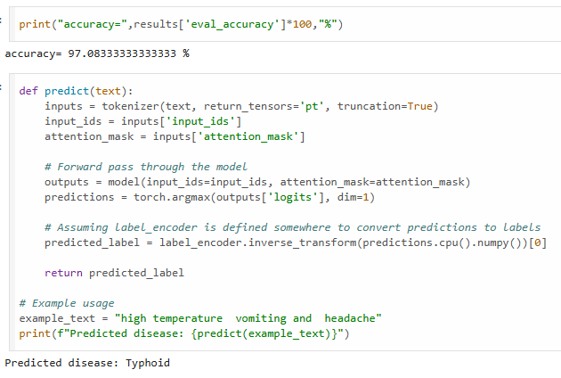

# Disease Prediction from Patient Symptoms

## Overview

This internship project presents a real-life disease prediction model using a fine-tuned BERT (Bidirectional Encoder Representations from Transformers) architecture. It predicts diseases based on patient-reported symptoms written in natural language, achieving up to 98% accuracy. The model aims to assist in early diagnosis and clinical decision support by interpreting free-text symptom descriptions.


## Features

- Fine-tuned BERT model for natural language understanding
- Processes patient symptom descriptions in text format
- Supports a wide range of medical conditions
- Achieves 98% classification accuracy
- Evaluated using standard NLP classification metrics

## Dataset

The model is trained on a medical symptom dataset with the following structure:

- `label`: The disease diagnosis
- `text`: A textual description of the patient’s symptoms

Dataset file used: `Symptom2Disease.csv`

## Model Architecture

- **Base Model**: BERT (from Hugging Face Transformers)
- **Type**: Multi-class text classification
- Fine-tuned specifically for the task of disease prediction based on textual input

## Implementation Details

**Programming Language**: Python

**Libraries and Frameworks**:
- PyTorch
- Hugging Face Transformers
- scikit-learn
- pandas
- numpy

## Key Components

### Data Preprocessing

- Cleaning and normalizing symptom descriptions
- Encoding disease labels into numeric format
- Tokenizing text using BERT tokenizer

### Model Training

- Fine-tuning the BERT base model on the symptom-disease dataset
- Training and validation split for robust performance

### Evaluation

The model is evaluated using cross-validation and multiple classification metrics:

- Accuracy
- Precision
- Recall
- F1-score

## Usage

### 1. Install Dependencies

```bash
pip install torch transformers scikit-learn pandas numpy
